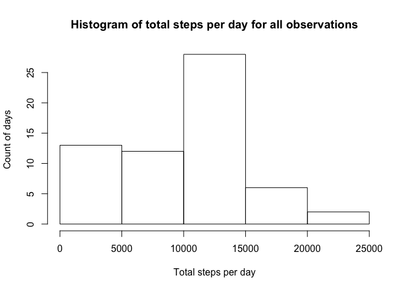
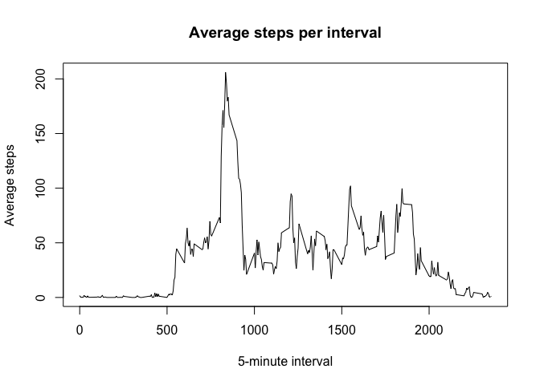
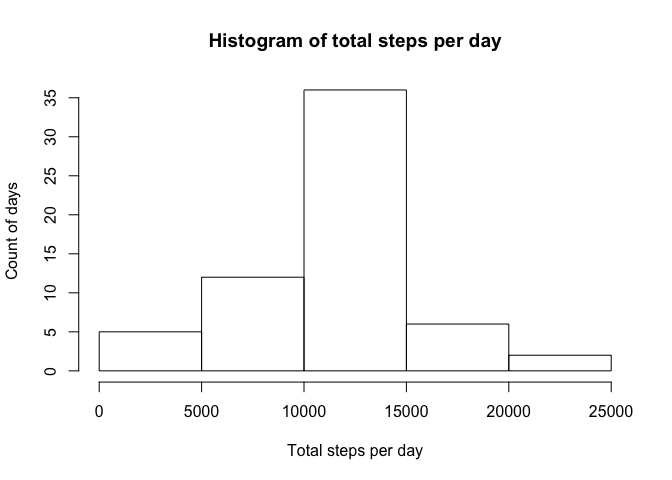
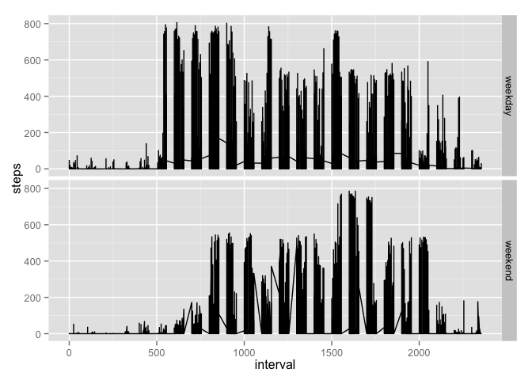

# Reproducible Research: Peer Assessment 1
This document describes analyses of data from a personal activity monitoring device for the first peer assessment of the reproducible research class.
You can download the data [here](https://d396qusza40orc.cloudfront.net/repdata%2Fdata%2Factivity.zip "Here").

The goal of the document is to allow other researchers to reproduce my results.

## Loading and preprocessing the data
For this step I assume the data is unzipped in the working directory


```r
amd <- read.csv("activity.csv")
```

## What is mean total number of steps taken per day?

### Step 1: load dplyr package
We need to load the dplyr package to get some transformations done.


```r
library(dplyr)
```

```
## 
## Attaching package: 'dplyr'
## 
## The following object is masked from 'package:stats':
## 
##     filter
## 
## The following objects are masked from 'package:base':
## 
##     intersect, setdiff, setequal, union
```

### Step 2: calculate steps per day

```r
by_date <- group_by(amd, date)

steps_by_date <- summarise(by_date, 
          total_steps = sum(steps, na.rm = TRUE))
```

### Step 3: create a histogram

```r
hist(steps_by_date$total_steps, main = "Histogram of total steps per day for all observations", xlab ="Total steps per day", ylab = "Count of days")
```

 

This histogram depicts the count of days for each total number of steps per day across all observations. Note that this totals all observations

### Step 4: mean and median of total number of steps taken per day
Note that this shows the average number of steps taken per day per observations, not across all observations as depicted above. 

```r
summarise(amd, 
          total_steps = mean(steps, na.rm = TRUE))
```

```
##   total_steps
## 1     37.3826
```

Note that this shows the median number of steps taken per day per observations, not across all observations as depicted above. As there are many observations where 0 steps are recorded, the median is 0. This could be due to faulty logging or users forgetting to wear the motion sensor. 

```r
summarise(amd, 
          total_steps = median(steps, na.rm = TRUE))
```

```
##   total_steps
## 1           0
```

## What is the average daily activity pattern?
### Step 1: calculate steps by interval

```r
by_interval <- group_by(amd, interval)

steps_by_interval <- summarise(by_interval,
                               average_activity = mean(steps, na.rm = TRUE))
```

### Step 2: create line plot of average steps by interval

```r
plot(steps_by_interval, type ='l', main = "Average steps per interval", xlab = "5-minute interval", ylab ="Average steps")
```

 

This plot shows that there are about 4 spikes of activity during the day. We don't know if the first interval corresponds to the morning. It does look like the first spike is about 2x-3x as large as the next two spikes.

### Step 3: find the 5-minute interval which contains the maximum numbers of steps, on average?

```r
filter(steps_by_interval, average_activity == max(steps_by_interval$average_activity))
```

```
## Source: local data frame [1 x 2]
## 
##   interval average_activity
## 1      835         206.1698
```
Interval 835 is the 5-minute interval which contains the maximum number of steps (206.1698)
This is coherent witht the first big spike we see in the graph.

## Imputing missing values
### Step 1: Calculate and report the total number of missing values in the dataset (i.e. the total number of rows with NAs)

```r
summary(amd)
```

```
##      steps                date          interval     
##  Min.   :  0.00   2012-10-01:  288   Min.   :   0.0  
##  1st Qu.:  0.00   2012-10-02:  288   1st Qu.: 588.8  
##  Median :  0.00   2012-10-03:  288   Median :1177.5  
##  Mean   : 37.38   2012-10-04:  288   Mean   :1177.5  
##  3rd Qu.: 12.00   2012-10-05:  288   3rd Qu.:1766.2  
##  Max.   :806.00   2012-10-06:  288   Max.   :2355.0  
##  NA's   :2304     (Other)   :15840
```

A quick summary shows there are 2,304 N/As for steps

### Step 2: strategy for completing missing steps 
I am basing the calculations for missing values on the mean of that interval

### Step 3: Create a new dataset that is equal to the original dataset but with the missing data filled in


```r
impute_mean_interval <- function(x) replace(x, is.na(x), mean(x, na.rm = TRUE))

# Add library plyr for some transformation work
library(plyr)
```

```
## -------------------------------------------------------------------------
## You have loaded plyr after dplyr - this is likely to cause problems.
## If you need functions from both plyr and dplyr, please load plyr first, then dplyr:
## library(plyr); library(dplyr)
## -------------------------------------------------------------------------
## 
## Attaching package: 'plyr'
## 
## The following objects are masked from 'package:dplyr':
## 
##     arrange, count, desc, failwith, id, mutate, rename, summarise,
##     summarize
```

```r
amd_no_NA <- ddply(amd, ~ interval, transform, steps = impute_mean_interval(steps))

# Make sure to fix ordering
amd_no_NA <- amd_no_NA[order(amd_no_NA$date), ]

# Make sure to ungroup to avoid grouping by all columns
amd_no_NA <- ungroup(amd_no_NA)
```

Quick check if all the NAs are resolved:

```r
summary(amd_no_NA)
```

```
##      steps                date          interval     
##  Min.   :  0.00   2012-10-01:  288   Min.   :   0.0  
##  1st Qu.:  0.00   2012-10-02:  288   1st Qu.: 588.8  
##  Median :  0.00   2012-10-03:  288   Median :1177.5  
##  Mean   : 37.38   2012-10-04:  288   Mean   :1177.5  
##  3rd Qu.: 27.00   2012-10-05:  288   3rd Qu.:1766.2  
##  Max.   :806.00   2012-10-06:  288   Max.   :2355.0  
##                   (Other)   :15840
```

### Step 4: calculate steps per day

```r
by_date_no_NA <- group_by(amd_no_NA, date)

steps_by_date_no_NA <- aggregate(by_date_no_NA$steps, by=list(Category=by_date_no_NA$date), FUN=sum)
```

### Step 5: create a histogram

```r
hist(steps_by_date_no_NA$x, main = "Histogram of total steps per day", xlab ="Total steps per day", ylab = "Count of days")
```

 

This histogram looks pretty similar to the histogram with the N/A's. The main difference is that the count of days with less than 5,000 steps per day is a lot smaller. That makes sense, as the N/As were counted as 0 steps per day.

# Step 6: mean and median of total number of steps taken per day

```r
summarise(amd_no_NA, 
          total_steps = mean(steps))
```

```
##   total_steps
## 1     37.3826
```

```r
summarise(amd_no_NA, 
          total_steps = median(steps))
```

```
##   total_steps
## 1           0
```
We see that the mean has stayed the same:

- We previously excluded N/As from the mean
- The new mean uses the average by interval

## Are there differences in activity patterns between weekdays and weekends?
### Step 1: add a factor for weekday is TRUE and weekend is FALSE

```r
library(timeDate)

amd_no_NA_day <-  mutate(amd_no_NA, 
                         name_day = weekdays(as.Date(date)))
```

### Step 2: create vector with days as weekday and weekend

```r
weekday <- revalue(amd_no_NA_day$name_day, c("Monday"="weekday", "Tuesday"="weekday", "Wednesday"="weekday", "Thursday"="weekday", "Friday" = "weekday", "Saturday"="weekend", "Sunday"="weekend"))
```

### Step 3: add logical vector to dataframe

```r
amd_no_NA_weekday <- cbind(amd_no_NA_day, weekday)
```

### Step 4: create plot

```r
library(ggplot2)
```


```r
ggplot(data=amd_no_NA_weekday, aes(x=interval, y=steps)) +
    facet_grid(weekday ~ .) +
    geom_line()
```

 

From the plot it looks like the weekend activities start at later intervals.
